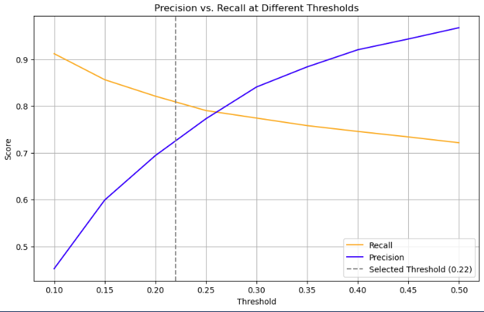
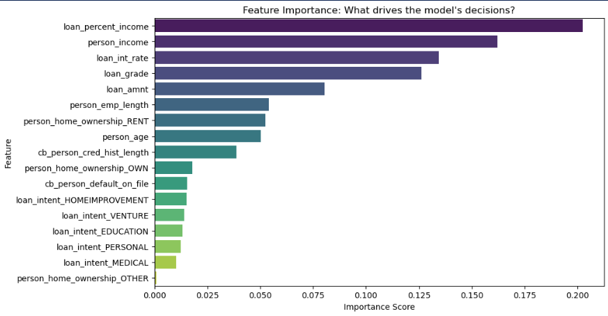
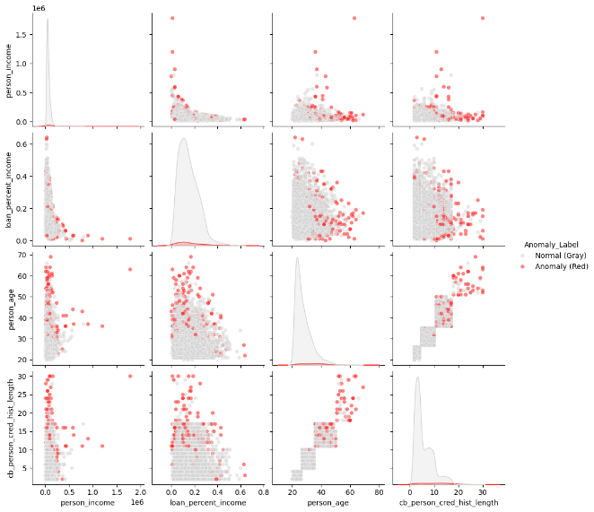

# Credit Risk Analysis: Hybrid Machine Learning Pipeline

### **Predicting Loan Defaults & Detecting Hidden Fraud**


## Project Overview
In financial lending, the cost of missing a default (losing money) is far higher than the cost of checking a safe applicant. This project builds a **Dual-Layer Risk System**:
1.  **Layer 1 (Supervised):** A Random Forest Classifier to predict loan defaults based on historical data.
2.  **Layer 2 (Unsupervised):** An Isolation Forest to detect "Hidden Risks" applicants who look safe on paper but exhibit statistical anomalies (potential fraud).

## Key Results
* **Optimized Recall:** 81% (Threshold tuned to 0.22 to prioritize catching defaults).
* **Risk Detection:** The Isolation Forest identified **216 "Hidden Risk" applicants** that the primary model initially approved.
* **Business Impact:** Proposed a hybrid workflow where the Machine Learning model handles auto-approvals, while "Hidden Risks" are routed for manual review.


## Technical Approach

### 1. Data Processing (`processing.py`)
* **Source:** [Credit Risk Dataset (Kaggle)](https://www.kaggle.com/datasets/laotse/credit-risk-dataset)
* **Outlier Removal:** Filtered unrealistic data (e.g., Age > 100, Employment > 60 years).
* **Segmentation Imputation:** Missing values were filled using group-specific medians (e.g., imputing Interest Rate based on Loan Grade).
* **Feature Engineering:** One-Hot Encoding for nominal variables and Ordinal Encoding for loan grades.

### 2. Machine Learning Pipeline (`modeling.py`)
* **Baseline:** Logistic Regression.
* **Improved Model:** Random Forest Classifier with `class_weight='balanced'`.
* **Anomaly Detection:** Isolation Forest (Contamination = 5%).

### 3. Threshold Optimization
The default decision threshold (0.50) missed too many defaults. I analyzed the **Precision-Recall Trade-off** and adjusted the threshold to **0.22**.
* **Result:** Recall increased from ~60% to **81%**, capturing significantly more high-risk loans.


## Visual Insights

### Threshold Optimization

*The plot below shows the tradeoff for Precision and Recall as the decision threshold changes.*



### The Feature Importance

*The plot below shows how the Random Forest model identifies key features for detecting defaults.*



### The "Hidden Risk" Phenomenon

*The plot below shows how the Isolation Forest (Red) detects outliers on the edges of the distribution among approved applicants.*




## How to Run

**Install requirements**
   ```bash
   pip install pandas numpy scikit-learn seaborn
   ```


## 📂 File Structure
* `Credit_Risk_Analysis.ipynb`: Main analysis notebook.
* `src/`: Contains the modular Python scripts (`processing.py`, `modeling.py`).
* `processing.py`: Functions for data cleaning and encoding.
* `modeling.py`: Functions for training RF, LR, and IF models.
* `data/`: Contains the raw dataset (`credit_risk_dataset.csv`).
* `images/`: Visualization exports for the README.


### Author
**Philip Zhang**
* https://www.linkedin.com/in/philip-zhang-916005326/
* https://github.com/phzhang1